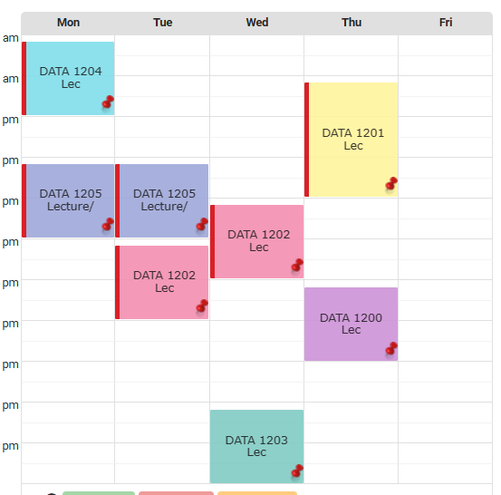

# 📊 Data Durham — Applied Data Analytics Hub

[](LICENSE)
[](https://durhamcollege.ca)
[](https://durhamcollege.ca)
[]()

A centralized repository for class timetables, course schedules, and academic milestone tracking for the Applied Data Analytics program at Durham College. Designed to help students coordinate coursework, track assignment deadlines, and stay aligned across lecture sessions.

---

## ✨ Features

- **Weekly Lecture Schedule**: Visual and structured timetable for Semester 1 core data analytics courses.
- **Course Mapping**: Overview of foundational data analysis, predictive modelling, and business assessment subjects.
- **Cohort Coordination**: Structured framework for sharing course timelines and tracking upcoming assignment deadlines.

---

## 📚 Curriculum & Course Breakdown

| Course Code | Course Title | Description |
| :--- | :--- | :--- |
| **DATA 1200** | Introduction to Data Analysis | Fundamental analytical methodologies and data wrangling concepts. |
| **DATA 1201** | Data Collection and Data Management | Database management, ingestion workflows, and data pipelines. |
| **DATA 1202** | Advanced Data Analysis Tools & Techniques | Scripting and data manipulation tools for modern analytics. |
| **DATA 1203** | Business Analysis and Assessments I | Business requirements, enterprise problem framing, and evaluation metrics. |
| **DATA 1204** | Statistical & Predictive Modelling I | Statistical distributions, hypothesis testing, and foundational predictive algorithms. |
| **DATA 1205** | Visualization & Communication for Data Analytics I | Dashboard design, visual storytelling, and business reporting. |

---

## 🗓️ Timetable Overview



### Weekly Schedule Matrix

- **Monday**:
  - Morning: `DATA 1204` (Statistical & Predictive Modelling I)
  - Afternoon: `DATA 1205` (Visualization & Communication I)
- **Tuesday**:
  - Afternoon: `DATA 1205` (Visualization & Communication I)
  - Afternoon: `DATA 1202` (Advanced Data Analysis Tools & Techniques)
- **Wednesday**:
  - Afternoon: `DATA 1202` (Advanced Data Analysis Tools & Techniques)
  - Evening: `DATA 1203` (Business Analysis & Assessments I)
- **Thursday**:
  - Afternoon: `DATA 1201` (Data Collection & Data Management)
  - Late Afternoon: `DATA 1200` (Introduction to Data Analysis)
- **Friday**:
  - Independent Study / Project Lab

---

## 📁 Project Structure

```text
Data-durham/
├── Intro.txt       # Program introductory notice and cohort collaboration note
├── Schedule.png    # Visual weekly class timetable
├── LICENSE         # MIT License
└── README.md       # Repository documentation and course guide
```

---

## 🚀 Getting Started

### Cloning the Repository

```bash
git clone https://github.com/Joeljozzz/Data-durham.git
cd Data-durham
```

### Usage

- **Class Timetable**: Consult the [Weekly Schedule Matrix](#weekly-schedule-matrix) or inspect [Schedule.png](Schedule.png) for lecture blocks and times.
- **Academic Milestone Tracking**: Use the course codes to track assignments, labs, and deliverables across your academic term.

---

## 📄 License

This project is licensed under the [MIT License](LICENSE) — see the LICENSE file for details.
